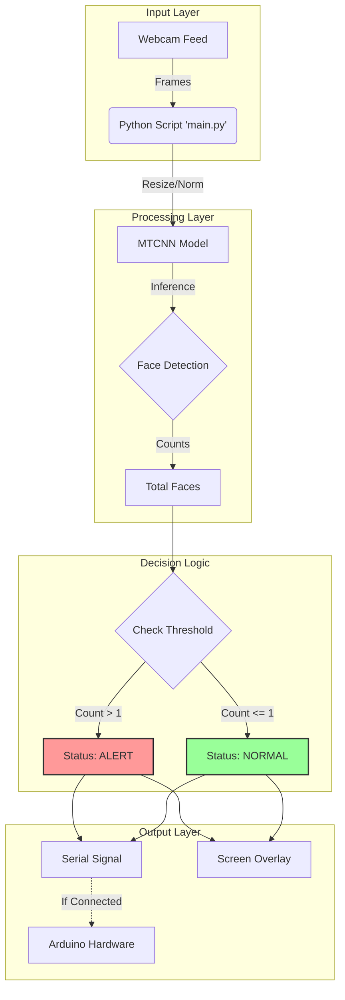

# Multi-Face-Sense

**Multi-Face-Sense** is a lightweight, real-time computer vision application designed to detect and count human faces via a webcam. Ideally suited for prototyping smart monitoring systems, it features an integrated alerting mechanism that can communicate with Arduino hardware or run in a standalone simulation mode.

This project serves as a foundational "building block" for larger IoT and surveillance applications, demonstrating how easy it is to bridge Python-based AI with physical hardware.

---

## 🚀 Key Features

*   **Real-Time Detection**: Utilizes **MTCNN** (Multi-task Cascaded Convolutional Networks), a proven industry standard for accurate face detection.
*   **Automatic Simulation Mode**: detecting the absence of hardware, the system automatically switches to an on-screen simulation, making it perfect for software-only testing.
*   **Hardware Integration**: Built-in support for serial communication with **Arduino** to trigger physical alarms (buzzers, LEDs) when specific conditions are met.
*   **Modest & Clean Codebase**: Refactored for simplicity, removing bloat and focusing on core logic, making it easy to learn from and modify.

---

## 🌍 Real-World Applications

While this project counts faces, the underlying logic is the seed for many practical solutions:

1.  **ATM Security / Privacy Booths**:
    *   *Concept*: Trigger an alert if more than one person is detected looking at the screen (prevention of "shoulder surfing").
    *   *Implementation*: Set threshold to `> 1`.

2.  **Smart Energy Management**:
    *   *Concept*: Automatically turn off lighting or HVAC systems in meeting rooms if `count == 0` for a certain duration.
    *   *Implementation*: Invert logic to send "OFF" signal when no faces are seen.

3.  **Retail Analytics & Queue Management**:
    *   *Concept*: Monitor checkout lines. If the face count in a specific region (queue) exceeds a limit, alert managers to open a new counter.
    *   *Implementation*: Adjust camera angle and set threshold `> 5`.

4.  **Capacity Monitoring (Health & Safety)**:
    *   *Concept*: Ensure elevators or small rooms do not exceed maximum occupancy limits.
    *   *Implementation*: Set threshold to maximum capacity (e.g., `> 4`).

---

## 🛠️ System Architecture

The system follows a simple linear data flow, making it highly reliable.



---

## 💻 Tech Stack

*   **Language**: Python 3.x
*   **Computer Vision**: OpenCV (`cv2`)
*   **AI Model**: MTCNN (TensorFlow/Keras based)
*   **Hardware Interface**: PySerial
*   **Data Processing**: NumPy

---

## ⚙️ Installation & Setup

### Prerequisites
*   Python 3.7 or higher installed on your system.
*   A working webcam.

### Step 1: Install Dependencies
Navigate to the project folder and install the required libraries using pip:
```bash
pip install -r Requirements.txt
```

### Step 2: Hardware Setup (Optional)
If you wish to use an Arduino:
1.  Connect your Arduino via USB.
2.  Open `main.py` and update the `SERIAL_PORT` variable (e.g., `COM3` on Windows or `/dev/ttyUSB0` on Linux).
3.  Upload a simple script to your Arduino that reads serial data and turns on an LED when it receives the string "Detected".

*Note: If you skip this step, the system will auto-detect the missing hardware and run in Simulation Mode.*

---

## 🏃 Usage

Run the main application script:

```bash
python main.py
```

### Controls
*   **`q`**: Press 'q' on your keyboard while the window is active to quit the application safely.

### Configuration
You can modify `main.py` to change behavior:
*   **`SERIAL_PORT`**: Change the COM port for Arduino.
*   **`BAUD_RATE`**: Default is 9600.
*   **Threshold logic**: Look for `if total_count > 1:` in the loop to change the triggering condition (e.g., change to `> 0` for any detection).

---

## 🐳 Dockerization (Advanced)

You can run this project in a Docker container. However, because it requires access to your **Webcam** and a **Display Window**, there are special considerations.

### 1. Build the Image
```bash
docker build -t multi-face-sense .
```

### 2. Running with GUI and Devices (Linux)
On Linux, you can pass the display and device directly:
```bash
docker run -it --rm \
    --env="DISPLAY" \
    --volume="/tmp/.X11-unix:/tmp/.X11-unix:rw" \
    --device="/dev/video0:/dev/video0" \
    multi-face-sense
```

### 3. Running on Windows
Docker Desktop on Windows has limitations for passing GPUs and USB devices natively. 
*   **Recommendation**: Run it natively in your Anaconda environment for the best performance with hardware.
*   **Headless Mode**: If you modify the code to save logs instead of showing a window (`cv2.imshow`), it will work easily in Docker.

---

## 🔧 Troubleshooting


*   **"Error: Could not open video source"**: Ensure your webcam is not being used by another application (like Zoom or Teams).
*   **Slow Performance**: MTCNN is accurate but CPU intensive. If you experience lag, try resizing the input frame in the code (`cv2.resize`) before passing it to the detector.
*   **TensorFlow Warnings**: You might see warnings from TensorFlow/MTCNN about optimizations. These are usually safe to ignore for basic usage.

---
*Created for educational purposes and rapid prototyping.*
